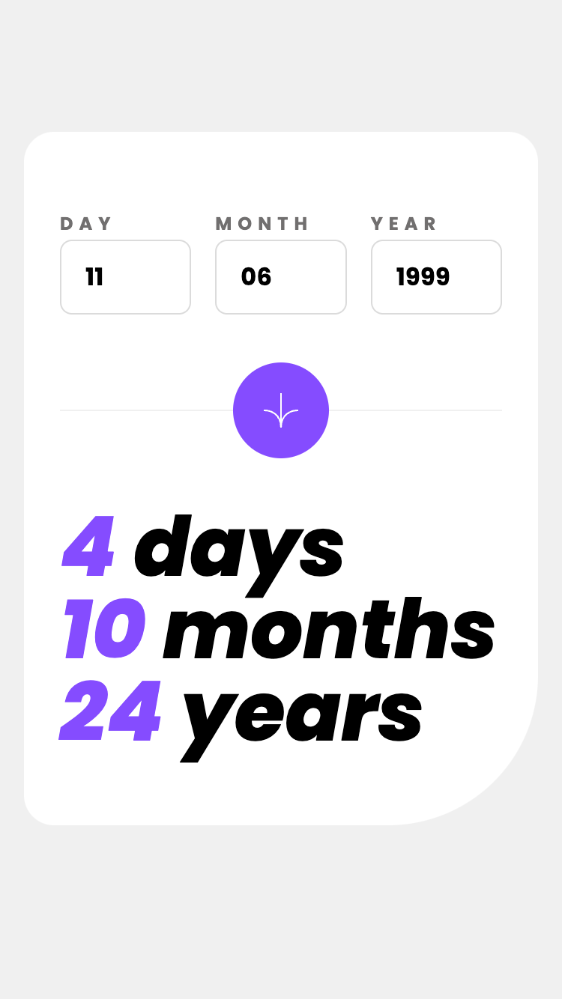
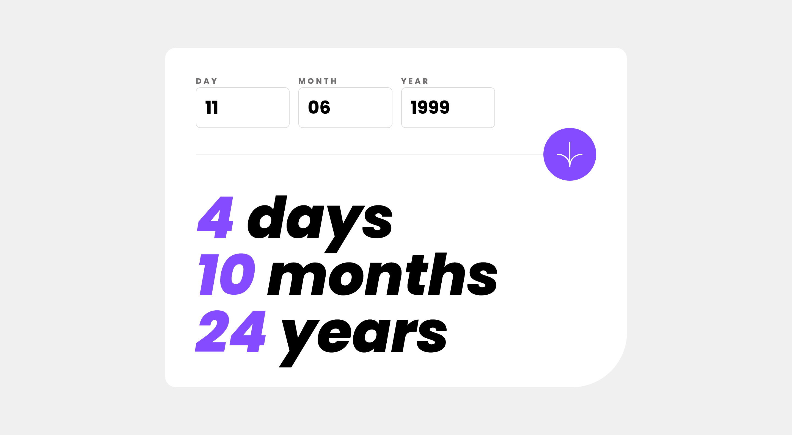

# Frontend Mentor - Age calculator app solution

This is a solution to the [Age calculator app challenge on Frontend Mentor](https://www.frontendmentor.io/challenges/age-calculator-app-dF9DFFpj-Q).

## Table of contents

- [Overview](#overview)
  - [The challenge](#the-challenge)
  - [Screenshot](#screenshot)
  - [Links](#links)
- [My process](#my-process)
  - [Built with](#built-with)
  - [What I learned](#what-i-learned)
  - [Continued development](#continued-development)
  - [Useful resources](#useful-resources)
- [Author](#author)

**Note: Delete this note and update the table of contents based on what sections you keep.**

## Overview

### The challenge

Users should be able to:

- View an age in years, months, and days after submitting a valid date through the form
- Receive validation errors if:
  - Any field is empty when the form is submitted
  - The day number is not between 1-31
  - The month number is not between 1-12
  - The year is in the future
  - The date is invalid e.g. 31/04/1991 (there are 30 days in April)
- View the optimal layout for the interface depending on their device's screen size
- See hover and focus states for all interactive elements on the page
- **Bonus**: See the age numbers animate to their final number when the form is submitted

### Screenshot

| Mobile | Desktop |
| -- | -- |
|  |  |

### Links

- Solution URL: [Add solution URL here](https://your-solution-url.com)
- Live Site URL: [Add live site URL here](https://your-live-site-url.com)

## My process

### Built with

- Semantic HTML5 markup
- Flexbox
- Mobile-first workflow
- [React](https://reactjs.org/) - JS library
- [React Hook Form](https://react-hook-form.com/) - Used for form management
- [Vite](https://vitejs.dev/) - Dev/Build tool
- [TailwindCSS](https://tailwindcss.com/) - For styles

### What I learned

On this occasion, I mainly reinforced the handling of forms in React using the React Hook Form library. I also learned to sharpen my sense of sight to be able to layout the designs as accurately as possible.
For the organization of the styles (and to make DX easier for me), I set the styles provided in the Tailwind configuration, achieving a much more accurate and quicker style selection.

### Continued development

I found it challenging, in part, to handle the form state, more so because of having to validate the date types and the inherent properties this entails.

## Author

- Website - [My GitHub](https://github.com/sebas-tcotd)
- Frontend Mentor - [@sebas-tcotd](https://www.frontendmentor.io/profile/sebas-tcotd)
- Twitter - [@sebas_tcotd](https://twitter.com/sebas_tcotd)

**Note: Delete this note and add/remove/edit lines above based on what links you'd like to share.**

## Acknowledgments

This is where you can give a hat tip to anyone who helped you out on this project. Perhaps you worked in a team or got some inspiration from someone else's solution. This is the perfect place to give them some credit.

**Note: Delete this note and edit this section's content as necessary. If you completed this challenge by yourself, feel free to delete this section entirely.**
